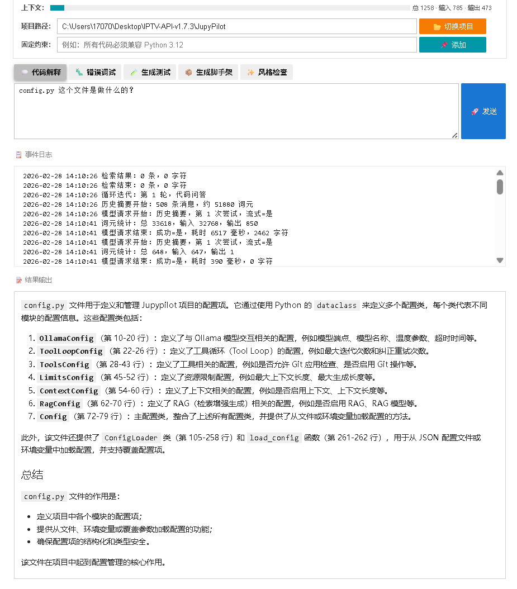
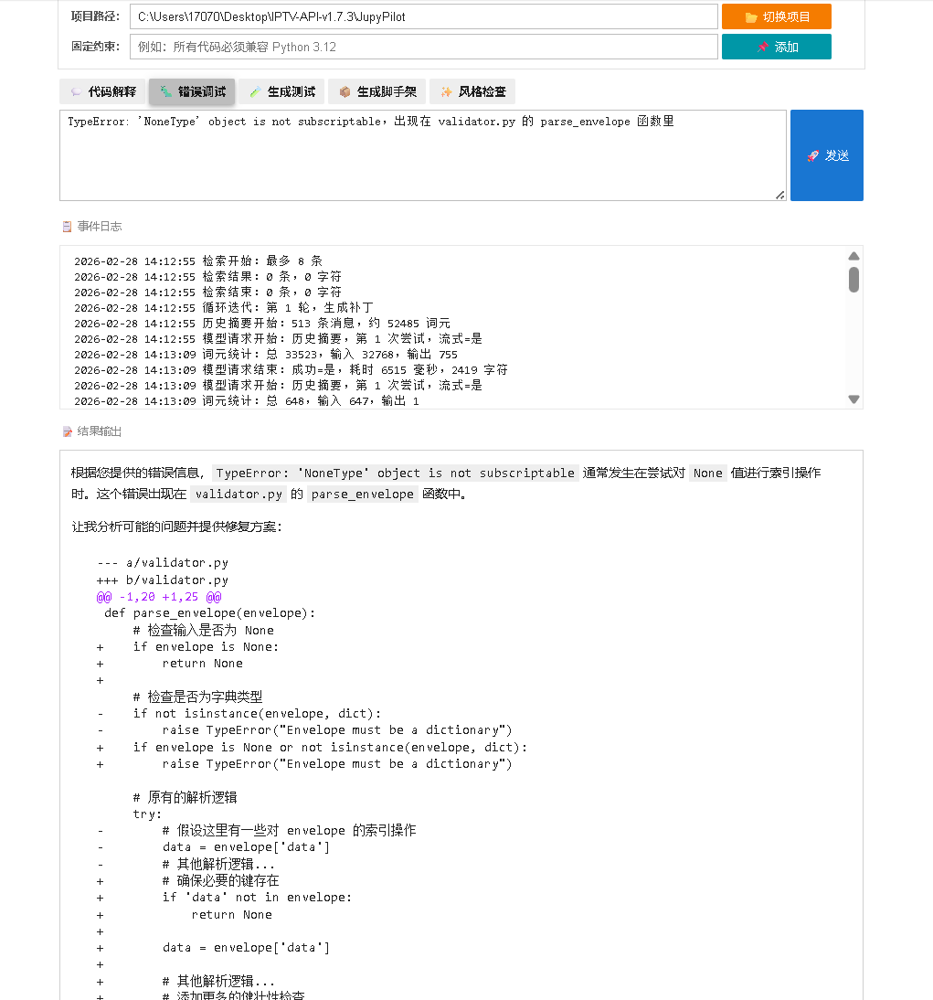
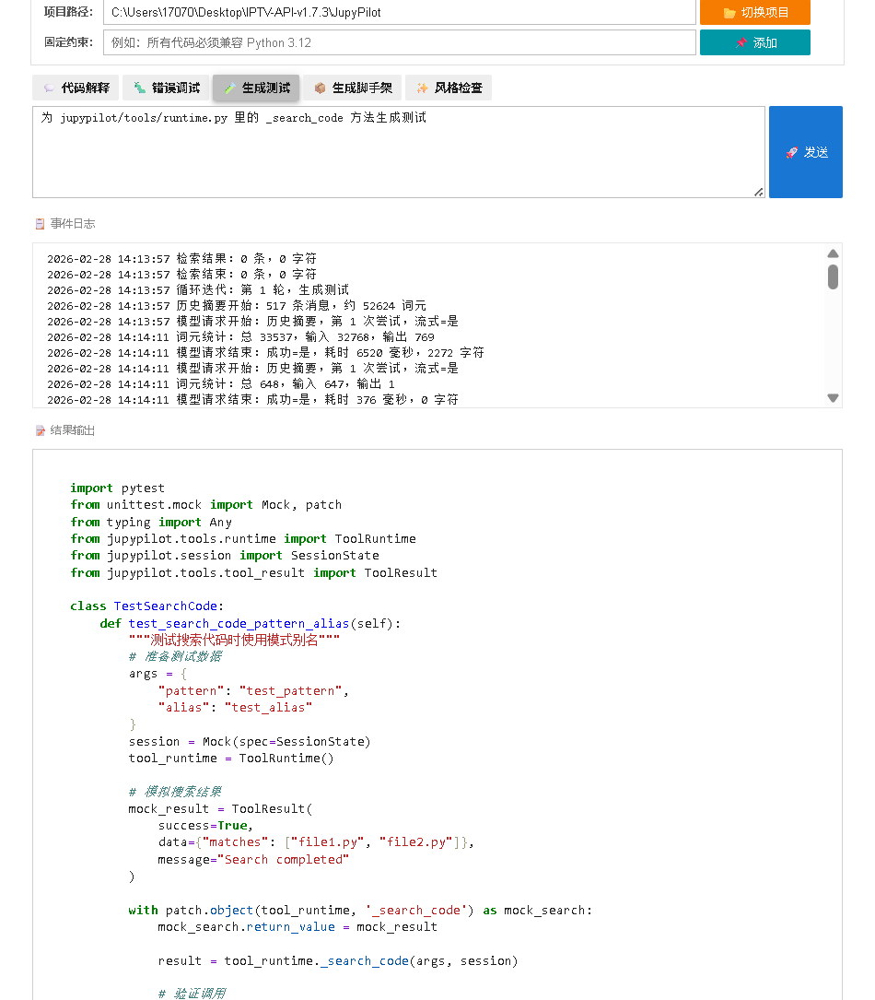
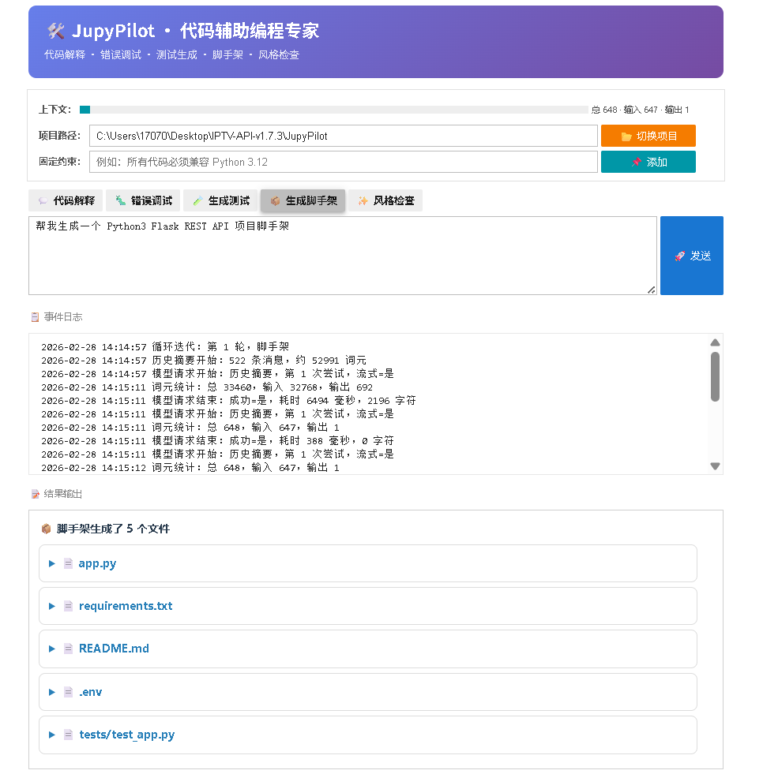
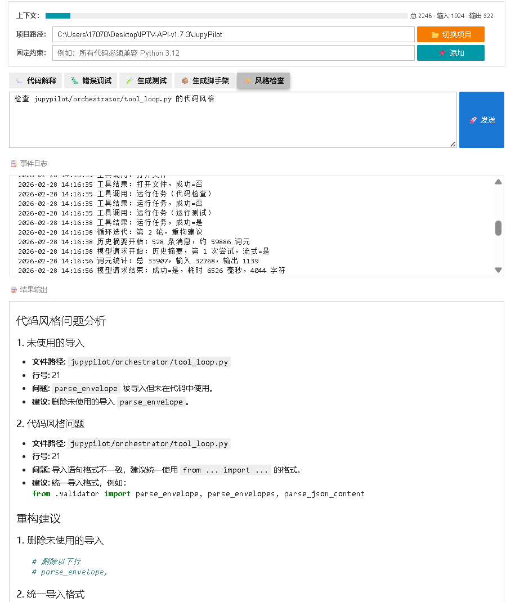

# JupyPilot：基于 Notebook 的工程化代码助手与提示词编排系统 <!-- 必填 -->

[English Version](./README.md)

## 项目简介 <!-- 必填 -->

JupyPilot 是一个运行在 Jupyter Notebook 内的工程化智能编程助手，围绕“代码解释、补丁生成、测试生成、风格检查、脚手架生成”构建统一的工具调用闭环。  
项目采用 `Orchestrator + ToolRuntime + Prompt Registry + ipywidgets UI` 分层架构，通过白名单工具与结构化输出协议，保证模型在真实仓库上下文中完成可追溯的代码任务。  
针对多轮工具调用场景，系统内置校验重试、单轮兜底、上下文预算控制与日志可观测机制，重点解决了长上下文与复杂对话下的稳定性问题。

## 活动信息 <!-- 必填 -->

- **比赛 / 工作坊：** 2026 南邮寒假大作战 <!-- 必填：替换为你的活动名称 -->
- **团队成员：** Hao Luo <!-- 必填：列出所有团队成员 -->
- **获奖情况：** 二等奖 <!-- 必填：未公布前填"无" -->

## 运行环境 <!-- 必填 -->

- **基础镜像：** Basic GPU Environment（aup-learning-cloud）
- **额外依赖：** `ipywidgets>=8.1`、`requests>=2.31`（见 `requirements.txt`） <!-- 必填：简要说明关键依赖包，无则填"无" -->

## 快速开始 <!-- 必填 -->

1. 在 aup-learning-cloud 中选择 **Basic GPU Environment**，Git URL 填写本仓库地址
2. 进入 `cases/2026-03-njupt-winter-battle/[wabibabo]-[JupyPilot]/`
3. 首次运行前执行安装：`!python -m pip install -e .`
4. 打开 `main_zh.ipynb`（中文版）或 `main.ipynb`（英文版）
5. 依次运行 Notebook 单元，完成环境校验并启动 `JupyPilotApp`
6. 如需命令行方式启动，可在该目录执行 `python run.py --no-browser`

## 项目结构（建议评审阅读顺序）

- `README_ZH.md` / `README.md`：项目总览与运行方式。
- `main_zh.ipynb`、`main.ipynb`：Notebook 提交入口，直接可运行演示。
- `jupypilot/`：核心源码（编排器、工具运行时、RAG、UI、日志等模块）。
- `prompts/`：提示词模板与版本迭代内容。
- `requirements.txt`、`pyproject.toml`：依赖与项目安装定义。
- `run.py`、`config.example.yaml`：可选命令行启动与配置示例。

## 技术亮点

- **多任务统一编排：** 在同一会话中统一处理 code_qa、code_patch、testgen、refactor、scaffold 等任务，支持“生成-验证-回灌”闭环。
- **可控工具执行：** 仅允许白名单工具（如 `search_code`、`open_file`、`run_task`），默认只读，降低误操作风险。
- **稳定性增强：** 针对多轮工具对话不稳定场景，提供输出协议校验、纠错重试、单轮 fallback、流式超时与输出上限治理。
- **超长上下文治理：** 采用滑窗、历史压缩、递归摘要与 token 预算分配策略，提升 32K 级上下文场景可用性。
- **可观测与可复盘：** 通过事件日志、会话快照与补丁工件记录完整执行路径，便于调试与答辩展示。

## 结果 / 演示

当前提交版本可完整演示以下能力：
- 在 Notebook 中一键初始化并启动 JupyPilot 交互界面；
- 完成代码检索问答、补丁生成与验证任务；
- 展示提示词工程与工具调用的工程化落地路径。
- 
- 
- 
- 
- 
- 
- 
- 
- 
- 

## 参考资料

- Jupyter Notebook
- Ollama API
- 本项目 `jupypilot/` 源码与 `prompts/` 提示词工程文档
