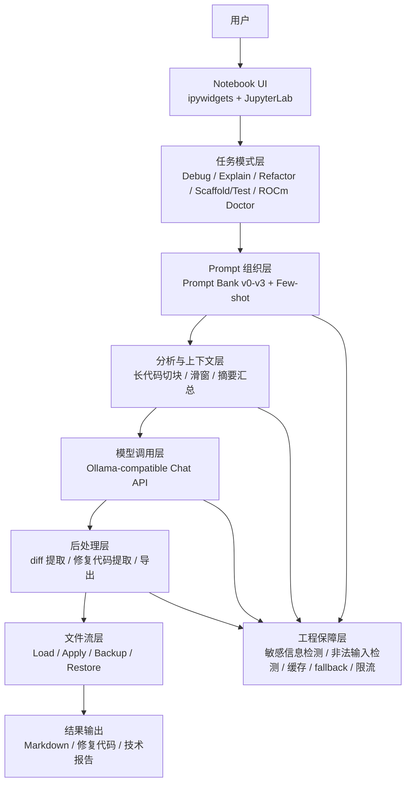
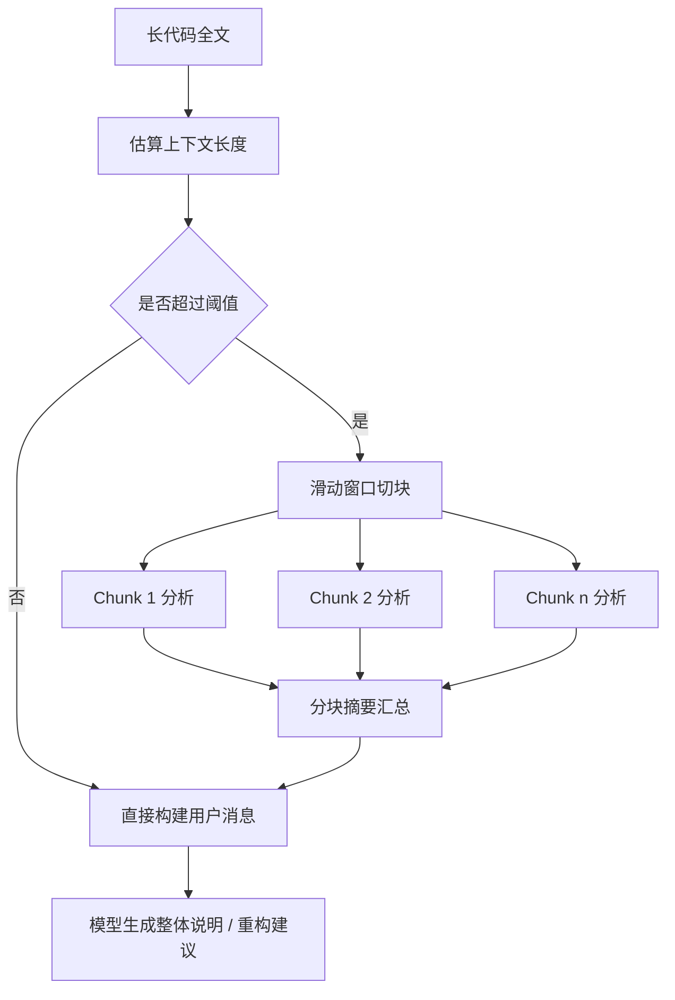

# Coldrain's ColdCode：面向 JupyterLab 的代码辅助编程专家

[English Version](./README.md)

## 项目简介

Coldrain's ColdCode 是一个面向 **JupyterLab Web 场景** 的 Notebook 交互式代码辅助编程系统。项目围绕“代码解释、错误定位、最小修复、代码重构、脚手架与测试生成，以及 AMD ROCm 环境问诊”六类典型任务，构建了一个可直接在单文件 `.ipynb` 中运行的完整应用闭环。

系统并不训练新的大模型，而是围绕现有大模型能力，结合 **提示词工程、长上下文处理、文件流操作、结果提取、缓存与回退机制**，将模型能力封装为一个更接近真实开发工作流的代码助手。当前最终提交版本已经支持 **单文件 Notebook 运行**，无需依赖额外源码目录。

## 活动信息

- **比赛 / 工作坊：** 2026 南邮寒假大作战 - AMD ROCm
- **团队成员：** 叶子恒、关舒文、戴瑞仪
- **获奖情况：** 三等奖

## 运行环境

- **运行方式：** AMD 提供的远程 JupyterLab Web 交互环境
- **推荐基础环境：** Basic GPU Environment（aup-learning-cloud）
- **模型调用方式：** 远程服务器内网模型服务（Ollama-compatible）
- **提交版本：** `main.ipynb` / `main_zh.ipynb`
- **额外依赖：** `httpx`、`ipywidgets`、`ipython`、`notebook`、`jupyterlab`，详见 `requirements.txt`

## 快速开始

1. 在比赛平台或 JupyterLab Web 环境中上传以下文件：
   - `main.ipynb` / `main_zh.ipynb`
   - `requirements.txt`
2. 在 Notebook 或 Terminal 中安装依赖：

```bash
pip install -r requirements.txt
```

3. 打开 `main.ipynb` / `main_zh.ipynb`。
4. 从头到尾运行所有单元，等待界面加载完成。
5. 在界面中选择模式（Debug / Explain / Refactor / Scaffold/Test / ROCm Doctor）、语言（Python / Java / C++），并输入问题、代码和报错信息。
6. 点击 **Run** 执行分析；若模型返回了修复后代码，还可进一步使用 **Apply / Apply to File / Restore Backup** 等操作。

如需覆盖默认模型地址和模型名称，可在启动前设置环境变量：

```bash
export COLDCODE_OLLAMA="http://open-webui-ollama.open-webui:11434"
export COLDCODE_MODEL_FAST="llama3.1:8b"
export COLDCODE_MODEL_STRONG="qwen3-coder:30b"
export COLDCODE_MIN_RUN_INTERVAL="1.5"
export COLDCODE_LONG_CODE_THRESHOLD="5000"
```

## 技术亮点

- 将代码辅助任务拆分为 **Debug、Explain、Refactor、Scaffold/Test、ROCm Doctor** 五种模式，避免单一聊天入口导致的结果漂移。
- 采用 **v0–v3 版本化 Prompt Bank**，支持不同模式下的提示词演进、Few-shot 示例和 Prompt Compare 展示。
- 引入 **长代码切块 + 滑动窗口 + 分块摘要汇总** 机制，提高 Explain / Refactor 场景下处理长代码的稳定性。
- 支持 **统一 diff 提取、修复后代码提取、Apply、Undo、Apply to File、Restore Backup** 等文件级操作闭环。
- 加入 **敏感信息检测、非法输入检测、频率限制、缓存、模型 fallback**，提升系统可靠性与可用性。
- 针对比赛环境新增 **ROCm Doctor** 模式，用于分析 AMD ROCm、PyTorch、驱动、权限与版本兼容相关问题。
- 支持 **错误成长卡（Learning Card）**、**技术报告导出** 与 **Prompt Compare** 等演示型增强功能。

## 结果 / 演示

当前提交版本可稳定完成如下类型的演示：

- 输入代码与 traceback 后，输出定位结论、原因解释、最小修复步骤、补丁与修复后代码。
- 对 Python / Java / C++ 代码进行结构化讲解与教学型解释。
- 在不改变功能的前提下，对代码进行最小重构并提取重构结果。
- 根据自然语言需求生成最小可运行项目骨架、核心文件与测试用例。
- 基于 ROCm 日志、安装命令和模型环境输出，进行 AMD GPU 环境问诊。
- 读取服务器上的文本代码文件，完成加载、写回、备份与恢复。

系统适合在评审现场按“Debug → Explain → Refactor → ROCm Doctor”顺序演示，以突出从问题定位到代码修改再到环境诊断的完整链路。

## 参考资料

- Ollama API Docs: [https://ollama.readthedocs.io/api/](https://ollama.readthedocs.io/api/)
- JupyterLab Documentation: [https://jupyterlab.readthedocs.io/](https://jupyterlab.readthedocs.io/)
- ipywidgets Documentation: [https://ipywidgets.readthedocs.io/](https://ipywidgets.readthedocs.io/)

## 项目背景与问题定义

在编程学习、课程实验、算法竞赛和模型环境调试过程中，初学者或参赛者通常会面临以下问题：

- 代码报错时，不知道应该先看哪一行、先改哪个点。
- 能够写出能跑的代码，但命名混乱、结构冗余、可读性较差。
- 面对较长代码文件时，通用聊天模型容易只看局部，讲解和重构结果不稳定。
- 在远程 JupyterLab 环境中，往往缺乏像本地 IDE 插件那样的代码辅助体验。
- 对 ROCm / PyTorch / 驱动与权限问题，常常只能人工比对日志，排查效率低。

本项目的目标，就是把“大模型问答”推进为一个更接近真实开发流程的 **JupyterLab 内嵌式代码辅助编程助手**，而不是停留在单次聊天演示。

## 设计目标

1. 让系统能够针对不同代码任务采用不同提示词与输出结构，而不是一个通用聊天框包打天下。
2. 让结果尽量具备可执行性，能够输出补丁、修复后代码、测试用例或项目骨架。
3. 让长代码处理具备稳定策略，在上下文有限的情况下仍能完成整体解释和重构建议。
4. 让文件级操作形成闭环，支持读文件、改文件、备份与恢复。
5. 让比赛环境中的 ROCm 场景得到专门支持，体现项目与平台的结合度。
6. 让作品最终能够以 **单文件 Notebook** 的方式交付与运行，便于部署和评审展示。

## 核心能力概览

- **代码调试（Debug）**：输入代码与 traceback，输出结论、证据、原因解释、修复步骤、diff 与修复后代码。
- **代码讲解（Explain）**：按总览、逐段解释、关键概念和常见坑讲解代码，面向初学者更友好。
- **代码重构（Refactor）**：在不改变功能的前提下，优化结构、命名、重复逻辑和可读性。
- **脚手架与测试生成（Scaffold/Test）**：根据自然语言需求生成最小项目结构、核心文件与测试代码。
- **ROCm 问诊（ROCm Doctor）**：结合日志、安装命令与脚本输出，判断 GPU 不可用、版本不匹配等问题。
- **文件流操作**：支持加载服务器文本文件、将修复结果写回文件，并在需要时恢复备份。
- **Prompt 对比与技术报告导出**：支持对比同一模式在 v0–v3 提示词下的差异，并导出 Markdown 结果与技术报告。

## 系统总体架构

下图整理了系统的主链路与模块关系：



## 核心流程详解

### 1. Debug 调试链路

Debug 模式是最适合评审展示的主链路之一。系统首先接收用户输入的代码与 traceback，然后根据语言类型（Python / Java / C++）组织对应的调试提示，尽量定位报错附近代码，最后要求模型输出结论、原因解释、修复步骤、补丁与修复后代码。


### 2. Explain / Refactor 长代码处理

对于较长代码，系统不会简单把全文直接丢给模型，而是先做长度估算；当超过阈值时，采用滑动窗口切块，对每个块分别做局部分析，再将局部结果汇总为整体讲解或整体重构建议。



### 3. Scaffold/Test 生成流程

系统可根据自然语言需求生成最小可运行项目，并针对不同语言给出更符合生态的测试建议，例如 Python 优先 pytest、Java 倾向 JUnit、C++ 倾向简单断言或测试驱动样例。

### 4. ROCm Doctor 环境问诊流程

ROCm Doctor 模式将代码、安装命令、日志和命令输出视为统一输入，优先判断问题更可能属于代码错误、环境问题、驱动权限问题、版本不匹配还是日志不足，从而给出更工程化的排查步骤。

## 提示词工程设计

项目将五类任务分别设计为独立提示词模式，并维护了 **v0、v1、v2、v3** 四个版本：

| 版本 | 特点 | 作用 |
|------|------|------|
| v0 | 朴素任务说明 | 构建最基础的可用版本 |
| v1 | 引入结构化标题与输出约束 | 降低回答格式波动 |
| v2 | 加入 Few-shot 示例 | 提高回答稳定性和风格一致性 |
| v3 | 增加工程边界、敏感信息提醒与结果约束 | 更适合真实使用场景 |

同时，项目提供 **Prompt Compare** 功能，可在界面中直接比较不同版本提示词，便于展示提示词工程的演进过程。

## 工程化与可靠性设计

项目在 Notebook 交互之外，还补充了一整套工程保障机制：

- **输入安全**：检查空输入、异常控制字符与疑似敏感信息。
- **缓存机制**：对相同请求进行缓存，减少重复调用模型带来的额外开销。
- **调用限频**：通过最小间隔控制连续提交，避免误触造成的高频请求。
- **模型回退**：当主模型调用失败时，可回退到更轻量模型继续完成任务。
- **结构化提取**：从模型输出中提取 diff、修复后代码等结构化结果，支撑后续 Apply。
- **文件备份恢复**：写回文件前自动创建备份，支持 Restore Backup。
- **单文件交付**：最终版本将所有模块内联回 Notebook，降低比赛环境中的部署复杂度。

## 项目结构与源码映射

最终交付版本以单文件 Notebook 为主，同时保留了模块化重构的思路：

| 路径 | 说明 |
|------|------|
| `main.ipynb` / `main_zh.ipynb` | 单文件最终提交版本，可直接运行完整功能 |
| `requirements.txt` | 运行依赖 |
| `README_ZH.md` | 中文说明文档 |
| `README.md` | 英文说明文档 |

单文件 Notebook 内部主要包含如下逻辑模块：

| 内联模块 | 作用 |
|---------|------|
| config | 模型地址、阈值、语言配置、模式说明 |
| prompts | Prompt Bank、Few-shot、消息构造 |
| guards | 敏感信息与非法输入检测 |
| cache | 缓存与状态记录 |
| llm client | 流式 / 非流式调用与 fallback |
| analysis | traceback 行号定位、长代码切块与分析 |
| extractors | diff 与修复后代码提取 |
| fileflow | 文件加载、写回、备份与恢复 |
| reports | Markdown 导出与技术报告导出 |
| UI | ipywidgets 交互界面与按钮事件 |

## 适用场景

- 编程课程实验中的代码讲解与错误定位。
- 初学者学习 Python / Java / C++ 时的辅助教学。
- 远程 JupyterLab 环境中的轻量代码助手。
- AMD ROCm 竞赛环境下的 GPU 兼容性与日志排查。
- 评审展示、课堂答辩、比赛说明与项目博客撰写。
