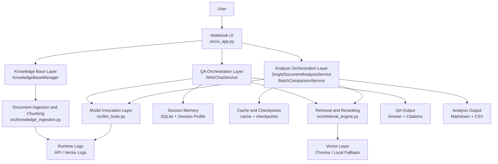
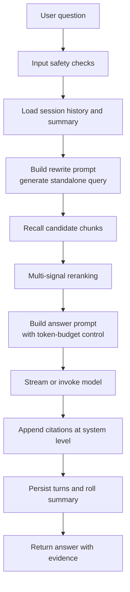
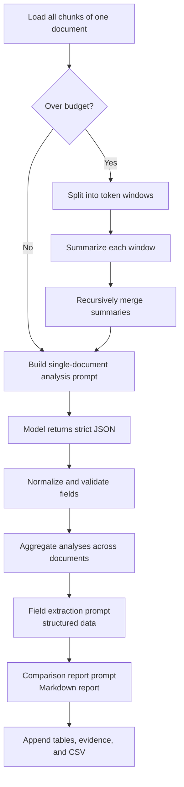
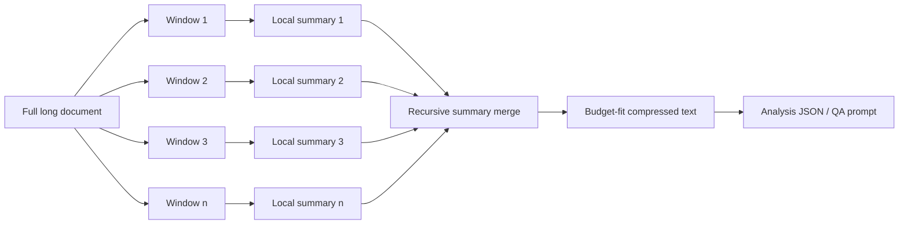

# Literature QA and Comparative Analysis System Based on Prompt Engineering and Long-Context Processing

[中文版本](./README_ZH.md)

## Project Overview

Literature QA and Comparative Analysis System Based on Prompt Engineering and Long-Context Processing is a notebook-based system for course-material QA, paper reading, and comparative literature analysis. Built on prompt engineering and long-context processing, it provides an end-to-end workflow covering document ingestion, knowledge-base construction, retrieval-based QA, single-paper analysis, multi-paper comparison, field extraction, and report export.

## Activity Information

- **Competition / Workshop:** 2026 NJUPT Winter Battle - AMD ROCm
- **Team Members:** Shi Suni, Yan Ran
- **Awarded:** First Prize

## Environment

- **Base Image:** Basic GPU Environment (aup-learning-cloud)
- **Extra Dependencies:** `langchain`, `langchain-openai`, `langchain-chroma`, `chromadb`, `ipywidgets`, `pypdf`, `python-docx`; see `requirements.txt`

## Quick Start

1. In aup-learning-cloud, select **Basic GPU Environment** and use this case repository as the Git URL.
2. Navigate to `cases/2026-03-njupt-winter-battle/liuhuayaxi-smart-paper-qa-assistant/`.
3. Open `main.ipynb` or `main_zh.ipynb`.
4. On the first run, if `config/app_config.json` does not exist, the notebook will generate it automatically from `config/app_config.example.json`.
5. Fill in your chat model, embedding model, and their OpenAI-compatible Base URLs. If both models are hosted behind the same service, they can share the same endpoint.
6. Run all notebook cells from top to bottom.
7. Build a knowledge base, import paper files, and start QA, single-document analysis, or batch comparison in the UI.

A typical configuration skeleton looks like this:

```json
{
  "OPENAI_CHAT_API_KEY": "your-api-key",
  "OPENAI_CHAT_BASE_URL": "http://your-compatible-endpoint/v1",
  "OPENAI_CHAT_MODEL": "your-chat-model",
  "OPENAI_EMBEDDING_API_KEY": "your-api-key",
  "OPENAI_EMBEDDING_BASE_URL": "http://your-compatible-endpoint/v1",
  "OPENAI_EMBEDDING_MODEL": "your-embedding-model"
}
```

## Technical Highlights

- Separate prompt templates are used for query rewriting, QA, single-document analysis, field extraction, and comparison reporting.
- Long-context stability is improved with sliding windows, recursive summarization, prompt compression, and deterministic degradation.
- Retrieval combines vector recall, multi-signal reranking, and system-level citation appending to improve answer traceability.
- Batch analysis supports caching, checkpoints, pause/resume, and structured export for realistic research workflows.

## Results / Demo

According to the project manual, the tested project version had already reached the following milestone counts:

- 66 raw source documents ingested;
- 2 knowledge bases maintained;
- 362 vector records created;
- 56 Markdown reports generated;
- 2 CSV files exported.

Typical outputs produced by the system include:

- QA responses with attached citation sections;
- structured single-document analysis JSON;
- multi-document Markdown comparison reports;
- field comparison tables, evidence sections, and warning blocks;
- resumable batch-analysis progress states.

## References

- Ollama API Docs: [https://ollama.readthedocs.io/api/](https://ollama.readthedocs.io/api/)
- LangChain Documentation: [https://python.langchain.com/docs/introduction/](https://python.langchain.com/docs/introduction/)
- Chroma Documentation: [https://docs.trychroma.com/](https://docs.trychroma.com/)

## Problem Setting

In real coursework and research workflows, users often need to work with mixed document formats such as PDF, Markdown, DOCX, and plain text. They need not only question answering for a single paper, but also structured analysis, cross-document comparison, targeted field extraction, and reusable report output.

Generic chat systems usually fall short in these scenarios:

- answers are difficult to verify against the source documents;
- long papers and multi-turn conversations easily exceed context limits;
- batch analysis jobs are fragile and expensive to restart;
- outputs are often descriptive only, rather than structured and reusable.

This project addresses those issues with a retrieval-centered and workflow-oriented architecture.

## Design Goals

1. Produce QA answers that are as evidence-grounded as possible.
2. Keep analysis steps reviewable, reproducible, and inspectable.
3. Handle long-context tasks with explicit and stable degradation strategies.
4. Support caching, checkpoints, pause/resume, and batch execution for real use.

## Core Capabilities

- Multi-format document ingestion with chunking and vector indexing.
- Retrieval-augmented question answering with citation post-processing.
- Single-document analysis with structured JSON output.
- Multi-document comparison with Markdown report generation.
- Targeted field extraction for structured research data.
- Long-context handling with sliding windows, recursive summarization, and prompt compression.
- Conversation memory, progress tracking, and resumable batch workflows.

## System Architecture

The following Mermaid diagram condenses the architecture described in the project manual:



## Workflow Breakdown

### 1. Knowledge-Base Construction

The ingestion pipeline transforms raw source files into retrievable chunks. Files are loaded by type, split structurally, chunked by length with boundary-aware logic, optionally merged when chunks are too small, and finally written into the vector store in batches. Failed batch writes can be rolled back to avoid partial corruption.


### 2. Retrieval QA Pipeline

The QA flow is designed to reduce unsupported answers. User input is validated first, then optionally rewritten into a standalone retrieval query, followed by recall, reranking, prompt planning under token-budget constraints, model generation, citation attachment, and conversation persistence.



Important engineering decisions in this flow:

- unsafe or noisy inputs are filtered before entering retrieval or generation;
- query rewriting is treated as a separate task with its own prompt template;
- reranking combines vector similarity, keyword coverage, phrase matches, and metadata signals;
- context overflow is handled with deterministic degradation steps;
- citations are appended by the system rather than freely invented by the model.

### 3. Single-Document Analysis and Batch Comparison

The analysis pipeline supports three connected tasks: structured analysis of a single document, targeted field extraction, and report generation across multiple documents. Long inputs are summarized before final analysis, and batch tasks can store progress checkpoints for later resumption.



### 4. Long-Context Processing

Long-context management is one of the core technical features of the project. Instead of naively truncating input, the system estimates token budgets, applies sliding-window summarization, recursively collapses intermediate summaries, and records degradation strategies for inspection.



The manual reports the following default parameters:

| Parameter | Default |
|-----------|---------|
| Model context window | 32000 |
| Reserved answer tokens | 6000 |
| Window size | 2400 |
| Window overlap | 240 |
| Recursive summary target | 1400 |
| Recursive summary batch size | 4 |
| Per-turn compression cap | 180 |
| Recent raw history turns kept | 6 |

## Prompt Engineering

The project defines separate prompt templates for different tasks instead of overloading one monolithic prompt. This makes the system easier to tune, audit, cache, and reason about.

| ID | Prompt Type | Purpose | Main Use |
|----|-------------|---------|----------|
| ① | Query rewrite prompt | Rewrite follow-up questions into standalone retrieval queries | Multi-turn QA |
| ② | QA system prompt | Constrain answers to retrieved evidence | RAG QA |
| ③ | Answer format instruction | Control answer shape and prevent model-side citation fabrication | RAG QA |
| ④ | Window summary prompt | Summarize one token window of a long document | Long-document analysis |
| ⑤ | Recursive merge prompt | Merge multiple window summaries | Long-document analysis |
| ⑥ | Single-document analysis prompt | Return strict JSON fields | Structured paper analysis |
| ⑦ | Field extraction prompt | Extract normalized structured fields with evidence binding | Data extraction |
| ⑧ | Comparison report prompt | Generate Markdown comparison reports | Batch comparison |

## Reliability and Engineering Design

The system includes several production-style safeguards:

- input filtering for empty, oversized, malformed, or sensitive content;
- timeout handling that distinguishes standard requests, first-token timeout, and stream-idle timeout;
- semaphore-based concurrency control for model calls;
- rollback logic for failed vector upsert batches;
- signature-based caches for rewrite, analysis, and extraction steps;
- checkpoint-based pause/resume for batch comparison workflows;
- local heuristic fallback paths for partial functionality when models are unavailable.

## Project Structure

| Path | Purpose |
|------|---------|
| `main.ipynb` | English notebook entry point |
| `main_zh.ipynb` | Chinese notebook entry point |
| `src/ui_app.py` | Notebook UI assembly and interaction logic |
| `src/knowledge_ingestion.py` | File loading, splitting, chunking, and ingestion |
| `src/retrieval_engine.py` | Recall, reranking, and QA orchestration |
| `src/analysis_engine.py` | Single-document analysis, extraction, and comparison |
| `src/llm_tools.py` | Prompt builders, model invocation, retries, and concurrency |
| `src/memory_store.py` | SQLite-backed session memory and summaries |
| `src/app_utils.py` | Token estimation, compression, caching, and citation helpers |
| `src/config.py` | Runtime configuration and directory management |
| `config/app_config.example.json` | Default configuration template |
| `requirements.txt` | Runtime dependencies |

## Use Cases

- course-material QA and review;
- academic paper reading and literature synthesis;
- cross-paper method comparison and evidence summarization;
- preparing project proposals, lab reports, and presentation materials.
