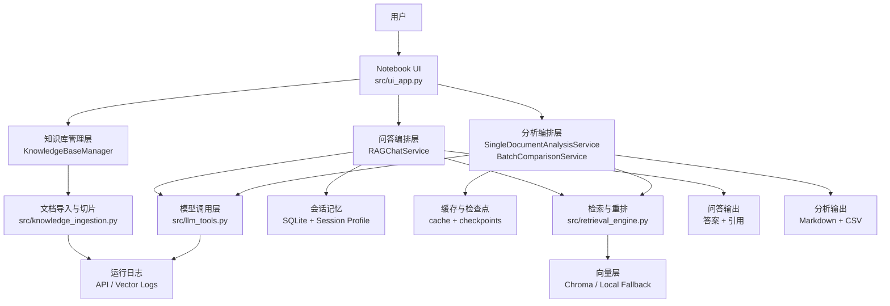
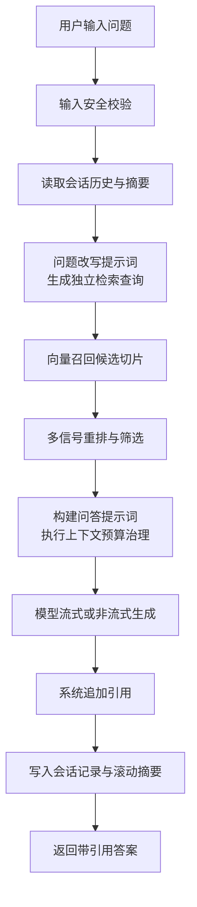
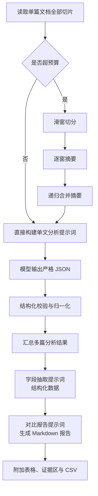
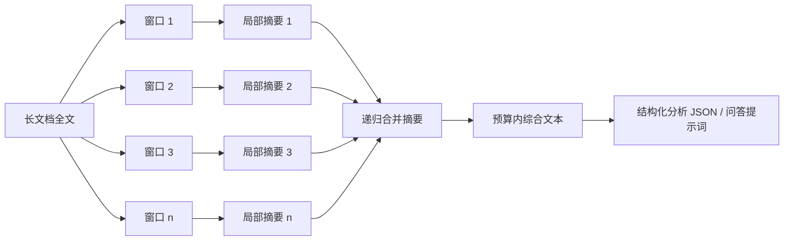

# 基于提示词工程与超长上下文处理的文献问答与对比分析系统

[English Version](./README.md)

## 项目简介

基于提示词工程与超长上下文处理的文献问答与对比分析系统是一个面向高校课程资料管理、科研文献阅读和批量比较分析场景的 Notebook 交互式系统。项目围绕论文导入、知识库构建、检索问答、单文档分析、多文档对比、结构化字段抽取与报告导出，构建了一个可落地、可复现、可解释的完整处理闭环。

## 活动信息

- **比赛 / 工作坊：** 2026 南邮寒假大作战 - AMD ROCm
- **团队成员：** 施苏倪、严冉
- **获奖情况：** 一等奖

## 运行环境

- **基础镜像：** Basic GPU Environment（aup-learning-cloud）
- **额外依赖：** `langchain`、`langchain-openai`、`langchain-chroma`、`chromadb`、`ipywidgets`、`pypdf`、`python-docx`，详见 `requirements.txt`

## 快速开始

1. 在 aup-learning-cloud 中选择 **Basic GPU Environment**，Git URL 填写本案例仓库地址。
2. 进入 `cases/2026-03-njupt-winter-battle/liuhuayaxi-smart-paper-qa-assistant/`。
3. 打开 `main_zh.ipynb` 或 `main.ipynb`。
4. 首次运行时，如果 `config/app_config.json` 不存在，系统会自动根据 `config/app_config.example.json` 生成默认配置。
5. 在配置文件中填写聊天模型、嵌入模型以及对应的 OpenAI-compatible Base URL；如果聊天模型和嵌入模型共享同一服务，可复用同一个服务地址。
6. 从头到尾运行 Notebook 所有单元，等待界面加载完成。
7. 通过界面创建知识库、导入论文文件，再执行问答、单文分析或批量对比。

一个典型配置示意如下：

```json
{
  "OPENAI_CHAT_API_KEY": "your-api-key",
  "OPENAI_CHAT_BASE_URL": "http://your-compatible-endpoint/v1",
  "OPENAI_CHAT_MODEL": "your-chat-model",
  "OPENAI_EMBEDDING_API_KEY": "your-api-key",
  "OPENAI_EMBEDDING_BASE_URL": "http://your-compatible-endpoint/v1",
  "OPENAI_EMBEDDING_MODEL": "your-embedding-model"
}
```

## 技术亮点

- 将问题改写、问答、单文分析、字段抽取和对比报告拆分为独立提示词模板，便于调参与审计。
- 引入滑动窗口、递归摘要、预算压缩和降级重试，增强长文档与长会话场景下的稳定性。
- 检索阶段结合向量召回、多信号重排与系统级引用追加，尽量提升答案的可追溯性。
- 批量分析支持缓存、检查点、暂停与继续，适合真实研究与课程使用场景。

## 结果 / 演示

根据作品说明书中的阶段性统计，截至该版本项目已实现并验证了如下结果：

- 已接入 66 份原始文档。
- 已维护 2 个知识库。
- 已写入 362 条向量记录。
- 已生成 56 份 Markdown 报告。
- 已导出 2 份 CSV 数据文件。

系统可以稳定产出以下结果：

- 带来源引用的问答结果。
- 单篇文档结构化分析 JSON。
- 多篇文档对比 Markdown 报告。
- 字段对比表、异常告警和证据区。
- 可继续的批量分析进度状态。

## 参考资料

- Ollama API Docs: [https://ollama.readthedocs.io/api/](https://ollama.readthedocs.io/api/)
- LangChain Documentation: [https://python.langchain.com/docs/introduction/](https://python.langchain.com/docs/introduction/)
- Chroma Documentation: [https://docs.trychroma.com/](https://docs.trychroma.com/)

## 项目背景与问题定义

在课程学习、论文调研和项目申报过程中，用户通常会面对 PDF、Markdown、DOCX 等多种格式文档混合输入，既需要对单篇材料做高质量问答和摘要，也需要对多篇文献做差异比较、结构化字段抽取和结论归纳。传统手工整理效率低，而通用对话系统又常见以下问题：

- 缺少可靠的来源追溯，回答“像是真的”，但难以复查。
- 面对长论文或多轮追问时，上下文容易溢出，结果漂移明显。
- 批量分析耗时长，任务一旦中断就需要从头再跑。
- 输出往往停留在自然语言层面，不便于后续统计、比较和报告复用。

本项目的目标，就是把“文献问答”升级为一个完整的工程化研究助手，而不是单次对话演示。

## 设计目标

1. 让问答结果尽量建立在检索证据之上，减少无依据回答。
2. 让分析过程可复查、可复现、可记录，而不是一次性黑盒输出。
3. 让超长上下文处理具备稳定策略，能在 32K 级上下文下持续工作。
4. 让批量分析任务支持缓存、检查点、暂停和恢复，适合真实使用场景。

## 核心能力概览

- 文档导入与知识库构建：支持 PDF、Markdown、DOCX、纯文本导入，自动切片并写入向量库。
- 检索增强问答：对用户问题进行安全校验、检索改写、向量召回、多信号重排和带引用回答。
- 单文档分析：对单篇论文生成摘要、关键词、主题和风险点等结构化结果。
- 多文档对比：批量分析多篇文献，输出结构化 Markdown 对比报告。
- 字段抽取：支持针对作者、方法、数据集、指标等目标字段进行结构化提取。
- 长文档治理：结合滑动窗口、递归摘要、预算压缩和降级重试处理超长上下文。
- 会话记忆与断点续跑：支持多轮问答记忆、批量任务暂停与继续。

## 系统总体架构

下图根据作品说明书整理了系统主链路与模块关系：



## 核心流程详解

### 1. 知识库导入与向量化

知识库管理模块负责把多格式原始文档转换成可检索、可引用的切片集合。系统先按文件后缀选择加载器，再做结构切分、长度切片、可选小块合并，最后按批次写入向量库；若某个批次写入失败，会回滚已经写入的切片，避免知识库进入半成功状态。


这一阶段对应的核心源码包括：

| 模块 | 作用 |
|------|------|
| `src/knowledge_ingestion.py` | 文档读取、结构切分、切片、入库编排 |
| `src/knowledge_base_manager.py` | 知识库级操作与状态管理 |
| `src/retrieval_engine.py` | 向量库初始化、切片写入、召回与重排 |

### 2. 检索问答流程

问答模块不是直接把问题扔给模型，而是先做输入安全校验和问题改写，再进行召回与重排，最后在上下文预算约束下构建问答提示词，并由系统后处理追加引用。这样做的核心目的，是把“能答”提升到“尽量有据可依地答”。



问答链路中的关键工程策略包括：

- 对输入执行非空、长度、控制字符和敏感信息检测。
- 使用检索改写提示词，把上下文依赖型追问改写成独立查询。
- 召回后不直接送模，而是结合向量分、关键词覆盖、短语命中和元数据匹配做重排。
- 提示词超预算时，按固定顺序压缩历史、删减切片、裁剪摘要，保证降载路径可复现。
- 引用由系统追加，而不是让模型自由生成，降低伪造引用风险。

### 3. 单文档分析、字段抽取与批量对比

分析模块把“读论文”拆成三个相互衔接的能力：单篇结构化分析、定向字段抽取、多篇报告对比。单篇分析先对长文做预算治理，再要求模型输出严格 JSON；批量对比会并发跑多篇文档分析与字段抽取，再生成 Markdown 报告和可选 CSV。



### 4. 超长上下文处理机制

长文档与多轮交互是项目最重要的技术难点之一。系统不是简单“截断输入”，而是做预算估算、滑窗摘要、递归合并和分级降载，尽量在有限上下文里保留更多高价值信息。



说明书中给出的默认参数包括：

| 参数 | 默认值 |
|------|--------|
| 模型上下文窗口 | 32000 |
| 回答预留空间 | 6000 |
| 滑窗大小 | 2400 |
| 滑窗重叠 | 240 |
| 递归摘要目标 | 1400 |
| 递归摘要批大小 | 4 |
| 历史单轮压缩上限 | 180 |
| 最近保留历史轮数 | 6 |

## 提示词工程设计

项目把不同任务拆成独立提示词模板，分别治理问答、分析和报告生成链路。所有模板都支持中英文配置，并可通过 `config/app_config.json` 持久化调整。

| 编号 | 提示词类型 | 主要用途 | 对应能力 |
|------|------------|----------|----------|
| ① | 问题改写提示词 | 将追问改写为独立检索查询 | 多轮问答 |
| ② | 问答系统提示词 | 约束回答必须优先基于检索证据 | RAG 问答 |
| ③ | 回答格式指令 | 限制输出结构，不允许模型自行拼接引用 | RAG 问答 |
| ④ | 滑窗摘要提示词 | 对长文档窗口做局部摘要 | 长文分析 |
| ⑤ | 递归合并提示词 | 合并多个窗口摘要 | 长文分析 |
| ⑥ | 单文档分析提示词 | 输出严格 JSON 结构化结果 | 单文分析 |
| ⑦ | 字段抽取提示词 | 抽取目标字段并绑定证据 | 结构化数据提取 |
| ⑧ | 对比报告提示词 | 生成多文档 Markdown 报告 | 批量对比 |

## 工程化与可靠性设计

项目不是只做算法功能，还实现了一整套稳定运行机制：

- 输入安全：拦截空输入、超长文本、非法控制字符和疑似敏感信息。
- 模型调用治理：区分普通超时、流式首 token 超时和空闲超时，并支持重试与限流排队。
- 上下文预算控制：统一 token 估算、压缩策略标记和降级重试。
- 数据一致性：向量写入失败可回滚，减少半成功污染。
- 缓存复用：对查询改写、单文分析、字段抽取等步骤做签名缓存。
- 检查点续跑：批量分析可暂停后继续，避免长任务全部重跑。
- 本地保底：当模型或依赖不可用时，部分流程支持本地启发式 fallback。

## 项目结构与源码映射

| 路径 | 说明 |
|------|------|
| `main_zh.ipynb` | 中文演示入口 Notebook |
| `main.ipynb` | 英文演示入口 Notebook |
| `src/ui_app.py` | Notebook 交互界面与任务编排入口 |
| `src/knowledge_ingestion.py` | 文档导入、结构切分、切片逻辑 |
| `src/retrieval_engine.py` | 向量召回、重排、RAG 问答主流程 |
| `src/analysis_engine.py` | 单文分析、字段抽取、批量对比报告 |
| `src/llm_tools.py` | 提示词模板、模型调用、并发与超时控制 |
| `src/memory_store.py` | SQLite 会话记忆与摘要管理 |
| `src/app_utils.py` | token 估算、压缩、缓存、引用拼接等通用工具 |
| `src/config.py` | 配置加载、默认参数与运行目录管理 |
| `config/app_config.example.json` | 默认配置模板 |
| `requirements.txt` | 运行依赖 |

## 适用场景

- 课程资料问答与课后复习。
- 学术论文阅读、归纳和综述准备。
- 多篇文献的方法对比与结论汇总。
- 项目申报、组会汇报和阶段性研究报告准备。
