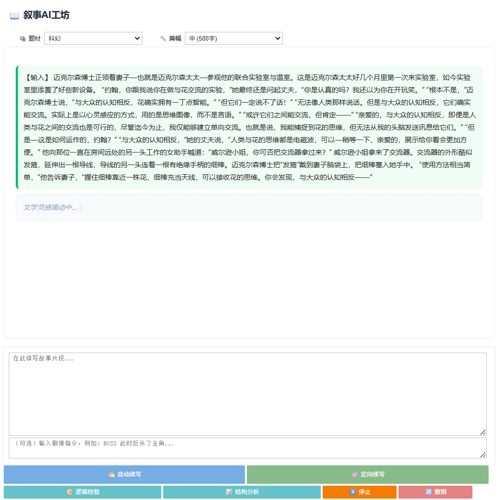
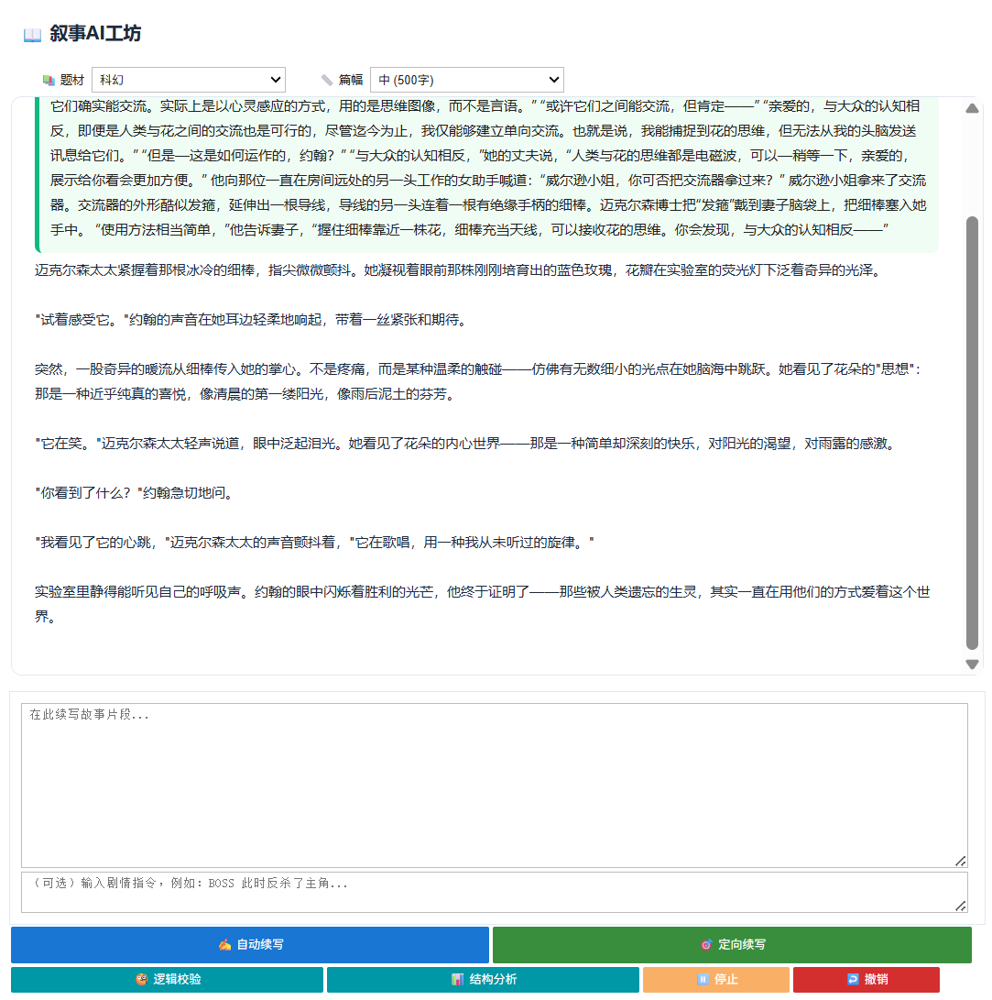
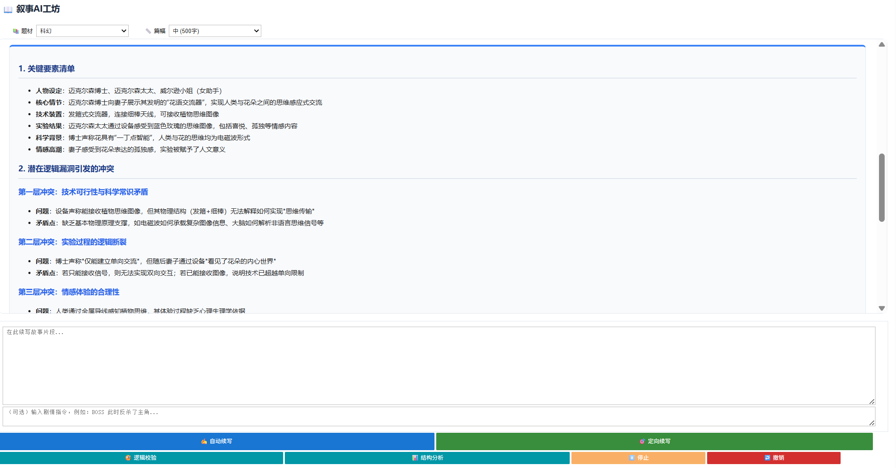
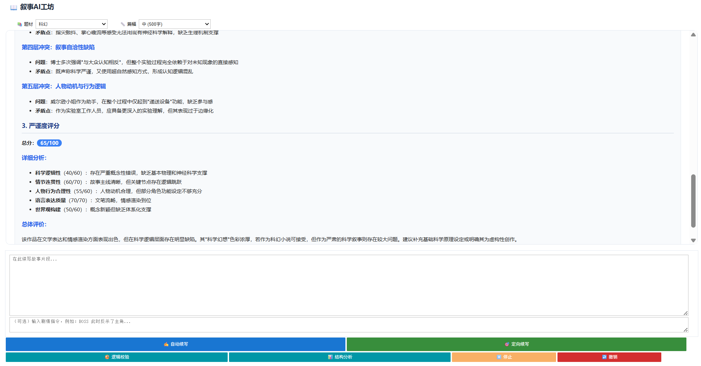
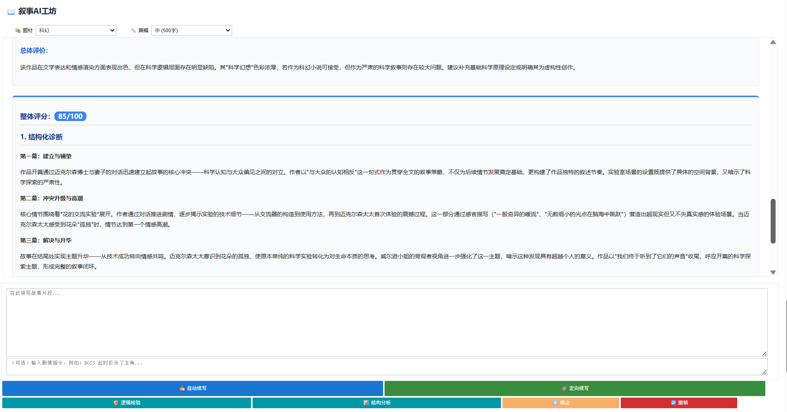
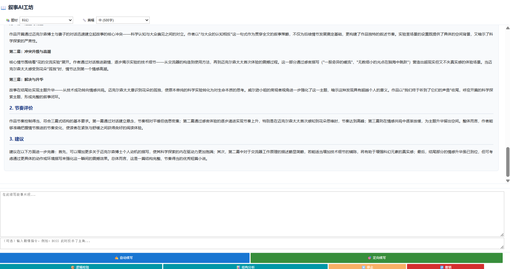
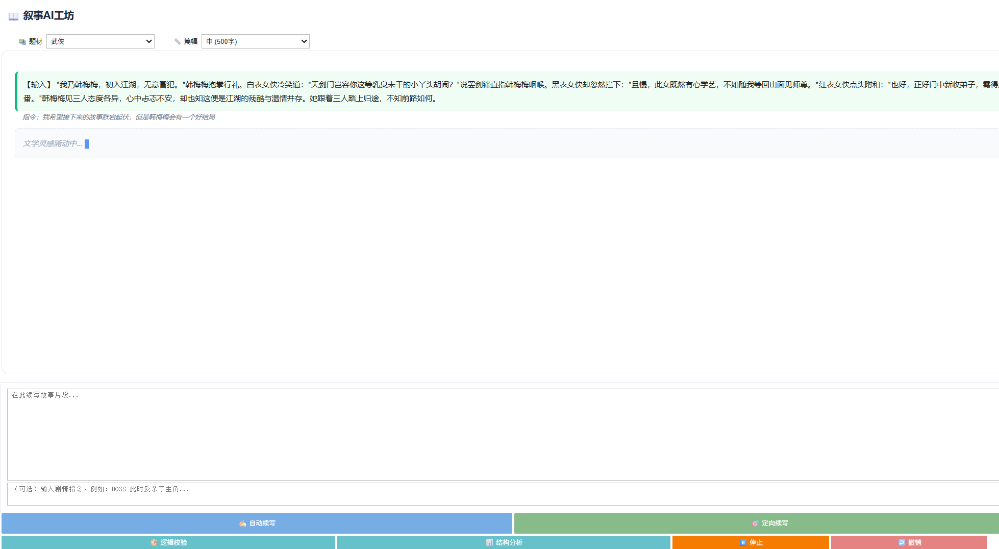
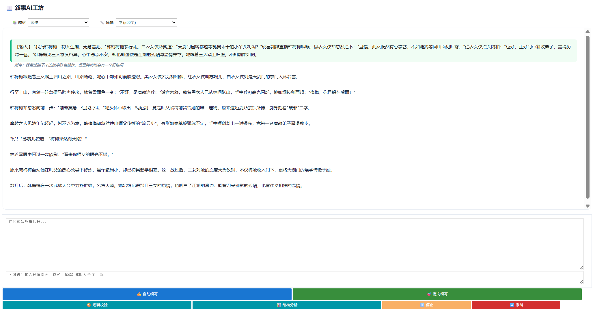

- #   交互式叙事与逻辑分析工坊

  [English Version](./README.md)

  ## 项目简介 

  本项目是一款专为小说创作者设计的智能辅助工具。它不仅能根据设定续写高水准的文学片段，还引入了“叙事审计”概念，利用大模型对情节的逻辑严密性进行实时监控周期性评估。

  - **解决痛点**：解决创作者在长篇写作中容易出现的“前后矛盾”、“情节注水”以及“结构涣散”等问题。
  - **核心价值**：将 AI 从单纯的生成工具转变为具备逻辑直觉的“虚拟编辑”。

  ## 活动信息 

  - **比赛 / 工作坊：** 2026 南邮寒假大作战 
  - **团队成员：** 刘小铭，滕茗妍 
  - **获奖情况：**  二等奖 

  ## 运行环境 

  - **基础镜像：** Basic GPU Environment（aup-learning-cloud）
  - **额外依赖：** 见 `requirements.txt` 

  ## 快速开始 
  1. 在 aup-learning-cloud 中选择 **Basic GPU Environment**，Git URL 填写本仓库地址
  2. 进入 `cases/2026-03-njupt-winter-camp/liuxiaoming-narrative-logic-workshop`
  3. 打开 `main_zh.ipynb`（中文版）或 `main.ipynb`（英文版）
  4. 从头到尾运行所有 Cell
  5. 在“在此续写故事片段...”处输入任意情节片段，再在下方点击任意按钮即可体验功能
  ## 技术亮点

  本项目采用 ***\*Frontend-Logic-Backend\**** 三层异步架构，确保在长时间推理过程中交互界面不卡死。 

  ```mermaid
  graph TD
      A[用户交互层 - ipywidgets] -->|指令/正文| B[逻辑中控层 - Python]
      B -->|Context 管理| C[计算后端 - AMD ROCm]
      C -->|qwen3-coder:30b| B
      B -->|异步渲染| A
      
      subgraph 逻辑中控细节
      B1[首尾锚点上下文截断] --> B2[Prompt 编排 CoT/Few-shot]
      B2 --> B3[多线程异步执行]
      end
  ```

  1. **超长上下文管理 (32k Truncation)**：针对赛题要求，实现了“首尾锚点平衡策略”，保留初始设定(Head)和最新剧情(Tail)，在 32k 限制内实现连贯创作。
  2. **逻辑一致性检测 (Consistency Audit)**：通过思维链 (Chain-of-Thought) 引导模型对前 5000 字进行逻辑审计，输出结构化的漏洞报告。
  3. **三幕式结构分析**：应用文学理论模型，从开端、对抗、结局三个维度对生成内容进行自动化打分。
  4. **鲁棒性工程**：设计了异步避震架构与物理级 `Stop` 按钮，完美解决 API 超时与界面假死问题。

  ## 结果 / 演示

  

  1.输入故事并续写
  
  
  2.测试一致性检测功能
  
  
  3.测试结构分析功能
  
  
  4.测试只给一个开头和短提示下的续写功能
  
  

  ## 参考资料

  - [AMD ROCm 官方文档](https://rocm.docs.amd.com/)
  - [Qwen3 模型说明](https://github.com/QwenLM/Qwen)
  - [文学理论：三幕式结构模型](https://en.wikipedia.org/wiki/Three-act_structure)
  - [宇宙无事发生](https://tw.z-library.sk/book/ZjKamZMXO0/%E5%AE%87%E5%AE%99%E6%97%A0%E4%BA%8B%E5%8F%91%E7%94%9F.html)
