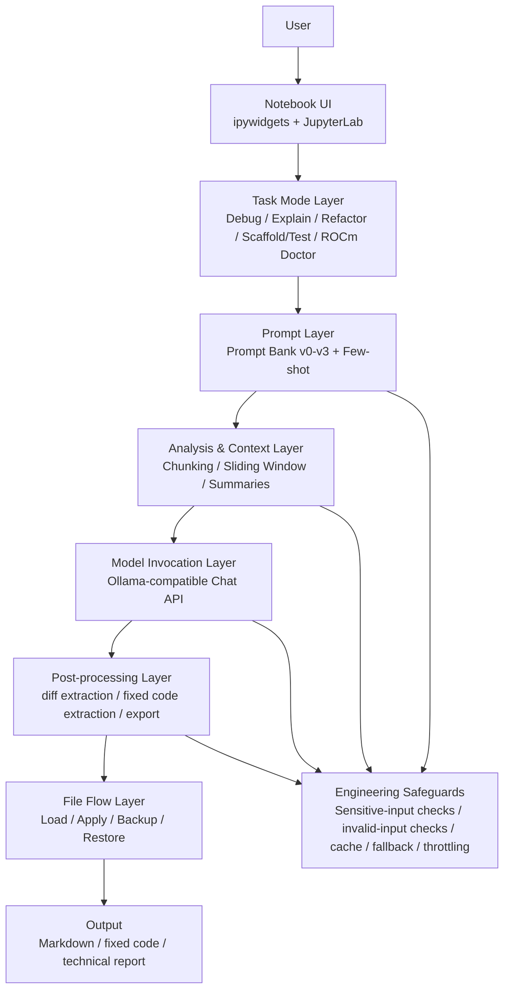
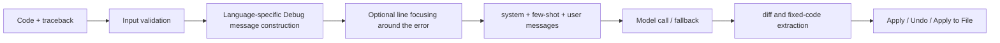

# Coldrain's ColdCode: A JupyterLab-Native AI Coding Assistant

[中文说明](./README_ZH.md)

## Project Overview

Coldrain's ColdCode is an interactive **Notebook-based coding assistant** designed for the **JupyterLab Web environment**. The project focuses on six common developer tasks: **code explanation, error debugging, minimal repair, code refactoring, scaffold/test generation, and AMD ROCm environment diagnosis**.

Rather than training a new model, the system builds on existing LLM capabilities and packages them into a practical coding workflow using **prompt engineering, long-context handling, file operations, output extraction, caching, and fallback strategies**. The final submission version runs as a **single `.ipynb` file**, without requiring an external source directory.

## Activity Information

- **Competition / Workshop:** 2026 NJUPT Winter Battle - AMD ROCm
- **Team Members:** Yeziheng, Guan Shuwen, Dai Ruiyi
- **Award:** Third Prize

## Environment

- **Execution Platform:** AMD-provided remote JupyterLab Web environment
- **Recommended Base Image:** Basic GPU Environment (aup-learning-cloud)
- **Model Access:** Internal Ollama-compatible model service on the remote server
- **Submission Version:** `main.ipynb` / `main_zh.ipynb`
- **Dependencies:** `httpx`, `ipywidgets`, `ipython`, `notebook`, `jupyterlab` (see `requirements.txt`)

## Quick Start

1. Upload the following files to the JupyterLab workspace:
   - `main.ipynb` / `main_zh.ipynb`
   - `requirements.txt`
2. Install dependencies in Terminal or Notebook:

```bash
pip install -r requirements.txt
```

3. Open `main.ipynb` / `main_zh.ipynb`.
4. Run all cells from top to bottom until the interface is fully loaded.
5. Select a mode (`Debug`, `Explain`, `Refactor`, `Scaffold/Test`, or `ROCm Doctor`), choose a language (`Python`, `Java`, or `C++`), and provide your question, code, and error logs if needed.
6. Click **Run** to execute the workflow. If repaired code is extracted successfully, you may continue with **Apply / Apply to File / Restore Backup**.

Optional environment variables for overriding default endpoints and models:

```bash
export COLDCODE_OLLAMA="http://open-webui-ollama.open-webui:11434"
export COLDCODE_MODEL_FAST="llama3.1:8b"
export COLDCODE_MODEL_STRONG="qwen3-coder:30b"
export COLDCODE_MIN_RUN_INTERVAL="1.5"
export COLDCODE_LONG_CODE_THRESHOLD="5000"
```

## Technical Highlights

- Splits coding assistance into **five explicit task modes**: `Debug`, `Explain`, `Refactor`, `Scaffold/Test`, and `ROCm Doctor`.
- Maintains a **versioned Prompt Bank (v0-v3)** with structured output constraints, few-shot examples, and prompt comparison support.
- Uses **long-code chunking, sliding windows, and chunk-level summarization** to improve stability for explanation and refactoring on larger code inputs.
- Supports a full file-oriented workflow: **diff extraction, repaired code extraction, Apply, Undo, Apply to File, and Restore Backup**.
- Includes **sensitive information checks, invalid input checks, request throttling, caching, and model fallback** for stronger reliability.
- Adds a dedicated **ROCm Doctor** mode to better match the AMD ROCm competition environment.
- Provides demonstration-friendly features such as **Learning Card**, **technical report export**, and **Prompt Compare**.

## Results / Demo

The current submission version can reliably demonstrate the following workflows:

- Given code and a traceback, it outputs a diagnosis, root-cause explanation, minimal fix steps, a patch, and repaired code.
- It explains Python / Java / C++ code with a teaching-oriented structure.
- It performs minimal refactoring without changing functional behavior and extracts the rewritten code.
- It generates a minimal runnable scaffold, core files, and tests from natural language requirements.
- It diagnoses AMD ROCm issues based on logs, installation commands, and model environment outputs.
- It loads code files from the remote server and supports write-back, backup, and restore.

A recommended demo order is: **Debug → Explain → Refactor → ROCm Doctor**, which clearly shows the path from diagnosis to modification and environment troubleshooting.

## References

- Ollama API Docs: [https://ollama.readthedocs.io/api/](https://ollama.readthedocs.io/api/)
- JupyterLab Documentation: [https://jupyterlab.readthedocs.io/](https://jupyterlab.readthedocs.io/)
- ipywidgets Documentation: [https://ipywidgets.readthedocs.io/](https://ipywidgets.readthedocs.io/)

## Background and Problem Definition

In programming courses, experiments, competitions, and model environment debugging, beginners and student developers often face the following challenges:

- When code fails, they do not know where to start or which line matters first.
- They can write runnable code, but naming, structure, and readability are often poor.
- For long code files, generic chat systems tend to focus only on local fragments, producing unstable explanations or refactoring suggestions.
- In remote JupyterLab environments, users usually do not have access to rich IDE plugin experiences.
- ROCm / PyTorch / driver / permission issues are difficult to debug manually and often require tedious log comparison.

This project aims to turn “LLM chat for code” into a more practical **JupyterLab-native AI coding assistant**, instead of a one-off conversation demo.

## Design Goals

1. Use different prompts and output structures for different coding tasks instead of a single generic chat box.
2. Produce actionable results such as patches, repaired code, tests, and project scaffolds.
3. Handle long code more robustly under limited context budgets.
4. Build a full file-oriented workflow with load, modify, backup, and restore operations.
5. Provide a dedicated mode for AMD ROCm diagnosis to better match the competition environment.
6. Deliver the final system as a **single-file Notebook** for easy deployment and presentation.

## Core Capabilities

- **Debug:** Takes code and traceback, then outputs diagnosis, evidence, explanation, fix steps, diff, and repaired code.
- **Explain:** Explains code in a beginner-friendly format with overview, section-by-section interpretation, key concepts, and common pitfalls.
- **Refactor:** Improves naming, structure, repeated logic, and readability without changing behavior.
- **Scaffold/Test:** Generates a minimal runnable project structure, core files, and test code from natural language requirements.
- **ROCm Doctor:** Diagnoses issues related to ROCm, PyTorch, GPU visibility, drivers, permissions, and version mismatches.
- **File Flow:** Supports loading remote text files, writing repaired code back, and restoring backups.
- **Prompt Compare and Report Export:** Compares prompt evolution across versions and exports Markdown results and technical reports.

## System Architecture

The following diagram summarizes the main workflow and module relationships:



## Workflow Details

### 1. Debug Pipeline

The Debug mode is one of the most presentation-friendly pipelines. The system accepts source code and traceback logs, builds language-specific debugging prompts, attempts to focus on the nearby error region, and asks the model to produce a diagnosis, explanation, minimal fix steps, a patch, and repaired code.



### 2. Long-Code Handling for Explain / Refactor

For longer code inputs, the system does not simply push the full text into the model. Instead, it estimates size first; if the code exceeds a threshold, it applies sliding-window chunking, performs chunk-level analysis, and then merges those local findings into a final global explanation or refactoring recommendation.

### 3. Scaffold/Test Generation

The system can generate minimal runnable projects from natural language requirements and provides language-aware testing suggestions, such as pytest for Python, JUnit-style tests for Java, and simple assertion-driven tests for C++.

### 4. ROCm Doctor Diagnosis

ROCm Doctor treats code, install commands, logs, and command outputs as a unified diagnostic input. It prioritizes classifying issues into code bugs, environment problems, driver/permission issues, version mismatches, or insufficient logs, and then gives practical troubleshooting steps.

## Prompt Engineering Design

The project organizes five task families into dedicated prompt modes and maintains **four prompt versions: v0, v1, v2, and v3**.

| Version | Characteristics | Role |
|---------|-----------------|------|
| v0 | Basic task instruction | Establishes the earliest functional baseline |
| v1 | Structured headings and output constraints | Reduces output instability |
| v2 | Few-shot examples | Improves consistency and style |
| v3 | Engineering constraints, sensitive-input awareness, output discipline | Better suited for real usage |

A built-in **Prompt Compare** feature can display prompt differences across versions, making the evolution of prompt engineering visible during demos.

## Engineering and Reliability Design

The system includes several practical safeguards beyond model prompting:

- **Input safety:** checks for empty input, suspicious control characters, and possible sensitive data.
- **Caching:** reuses repeated requests to reduce unnecessary model calls.
- **Request throttling:** prevents accidental rapid repeated submissions.
- **Model fallback:** falls back to a lighter model if the primary model fails.
- **Structured extraction:** extracts diff and repaired code blocks for downstream Apply operations.
- **File backup and restore:** creates backups before overwriting files and supports restoration.
- **Single-file delivery:** the final version inlines all modules back into one Notebook for simpler deployment.

## Project Structure and Source Mapping

The final submission focuses on the single-file Notebook format while preserving the modular design philosophy:

| Path | Description |
|------|-------------|
| `main.ipynb` / `main_zh.ipynb` | Final single-file submission that runs the full feature set |
| `requirements.txt` | Runtime dependencies |
| `README_ZH.md` | Chinese project description |
| `README.md` | English project description |

Main logical components embedded in the Notebook:

| Embedded Module | Responsibility |
|----------------|----------------|
| config | model endpoints, thresholds, language configuration, mode descriptions |
| prompts | Prompt Bank, few-shot examples, message construction |
| guards | sensitive-input and invalid-input checks |
| cache | cache and state management |
| llm client | streaming / non-streaming calls and fallback |
| analysis | traceback focusing, chunking, long-code analysis |
| extractors | diff and repaired-code extraction |
| fileflow | file loading, writing, backup, and restore |
| reports | Markdown export and technical report export |
| UI | ipywidgets-based interface and button events |

## Use Cases

- Code explanation and debugging in programming courses.
- Teaching assistance for beginners learning Python / Java / C++.
- Lightweight coding support in remote JupyterLab environments.
- GPU compatibility and log diagnosis for AMD ROCm competition tasks.
- Project demos, classroom defense, competition presentations, and technical blog writing.
